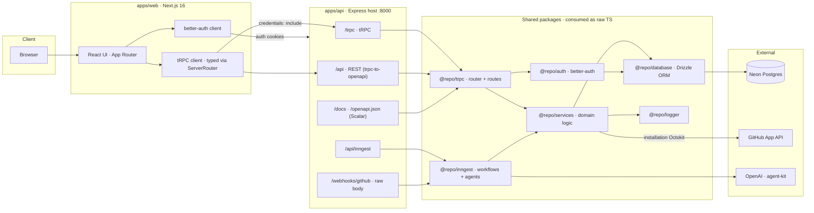
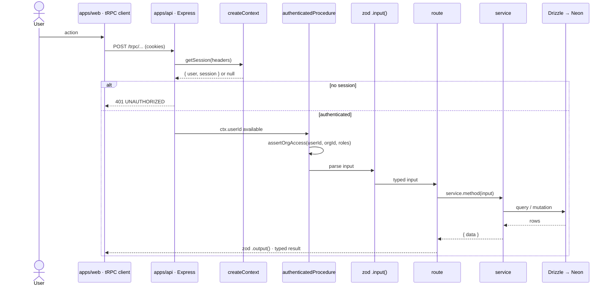
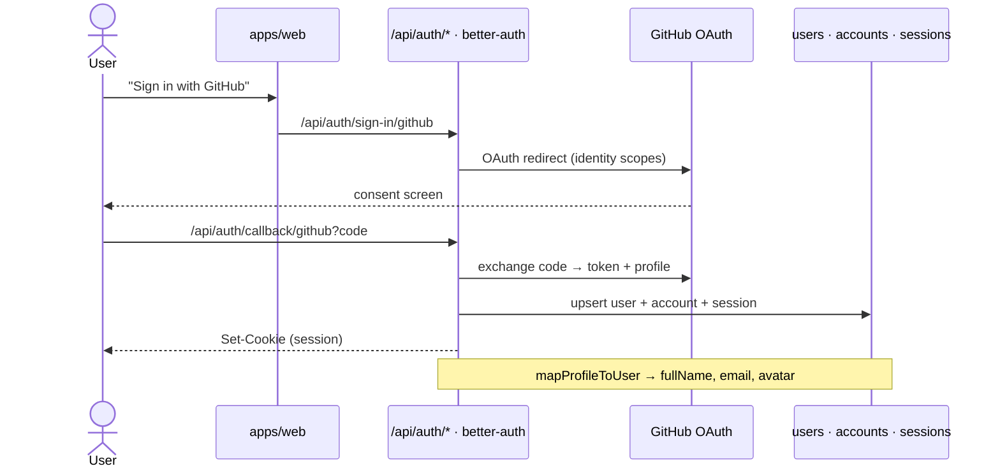
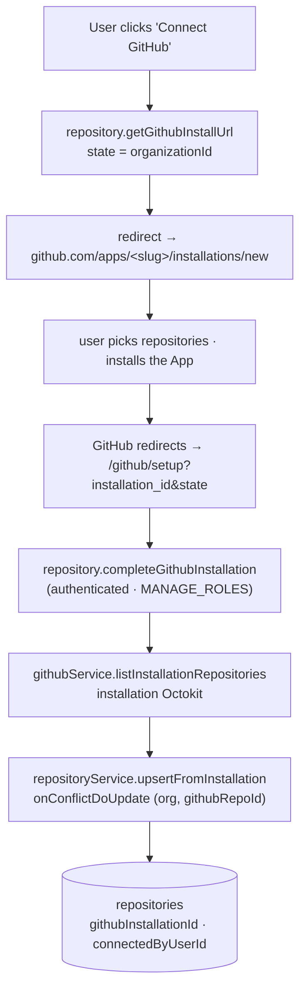
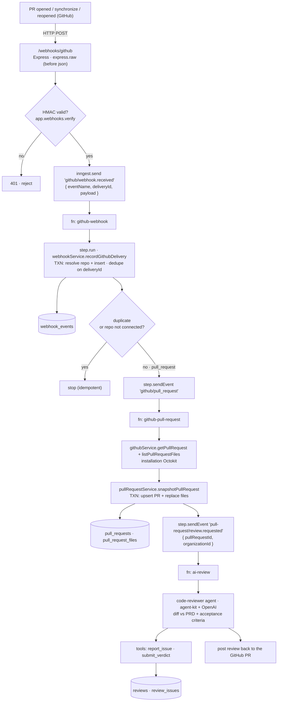
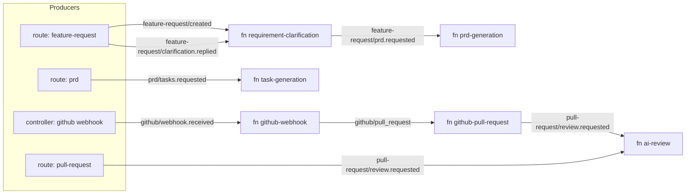
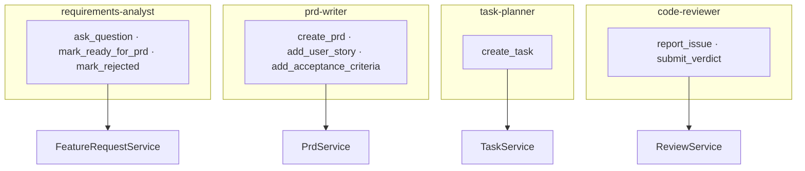
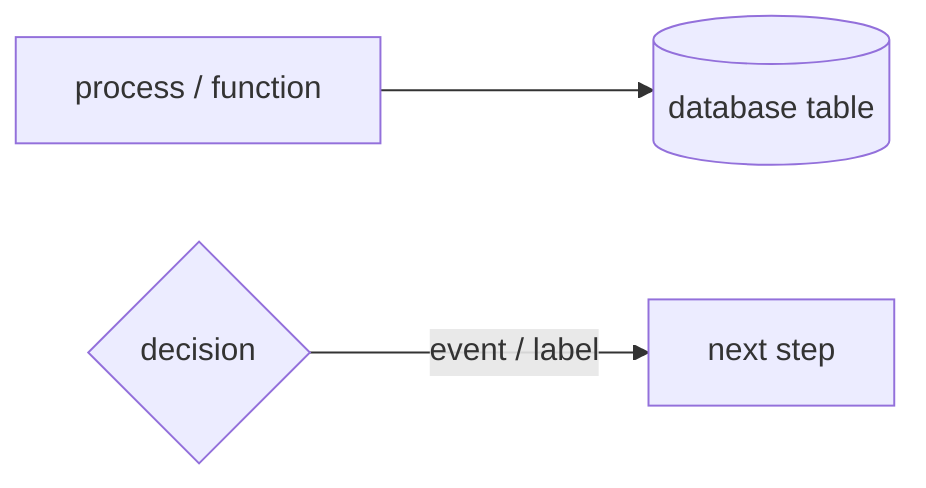

# ShipFlow AI — Architecture & Flow

AI‑assisted product delivery: **feature request → PRD → tasks → code → AI review → human approval → ship.**

The system is a Turborepo monorepo. The tRPC router is hosted by a standalone **Express** API (not Next.js), background work runs on **Inngest**, and GitHub is integrated as a **GitHub App** (installation tokens) with **better‑auth** handling user login.

> All diagrams below are [Mermaid](https://mermaid.js.org) — they render natively on GitHub and in most IDEs.

---

## 1. System architecture (layers)



**Layering (request → data):**

```
apps/api (Express host)
  └─ @repo/trpc   server/routes/<feature>/route.ts   · procedures, zod in/out, openapi meta
       └─ @repo/trpc   server/services/index.ts       · service singletons
            └─ @repo/services   <domain>/index.ts      · business logic (classes)
                 └─ @repo/database   models/*          · Drizzle client + schema → Neon
```

---

## 2. tRPC request lifecycle

Every procedure is dual‑purpose (tRPC at `/trpc` **and** REST at `/api`). Auth + org access are enforced before the service runs.



---

## 3. Authentication — better-auth (GitHub login)

better-auth handles **identity only** (login). Repo API access is a _separate_ concern (GitHub App, §5–6).



---

## 4. GitHub App — installation flow (connect repos)



**Why an App (not the login token):** acts as a **bot**, works in background jobs with **no user session**, per‑repo least privilege, and managed webhooks — matching the `githubInstallationId` / `webhookSecret` columns already in the schema.

---

## 5. Webhook → AI review (the core event chain)

The heart of the system. One thin **recorder** function fans out to a dedicated **PR** function, which snapshots the diff and asks for a review.



**Under-the-hood guarantees**

| Concern     | How                                                                             |
| ----------- | ------------------------------------------------------------------------------- |
| Signature   | `express.raw` mounted **before** `express.json()` so HMAC runs on exact bytes   |
| Idempotency | `onConflictDoNothing(deliveryId)` → re-deliveries return `duplicate: true`      |
| Atomicity   | `recordGithubDelivery` & `snapshotPullRequest` each run in one `db.transaction` |
| Freshness   | file snapshot is **replaced** on each push, so deleted files don't linger       |
| Isolation   | each stage is its own Inngest function → independent retries / rate limits      |
| ESM/CJS     | `octokit` v5 (ESM-only) loaded via dynamic `import()` from the CJS service      |

---

## 6. Product lifecycle (domain event flow)

```mermaid
flowchart LR
    FR["Feature Request"] -->|"feature-request/created"| RC["fn: requirement-clarification<br/>requirements-analyst agent"]
    RC -->|"ask_question"| USR["clarify w/ user"]
    USR -->|"feature-request/clarification.replied"| RC
    RC -->|"mark_ready_for_prd ·<br/>feature-request/prd.requested"| PG["fn: prd-generation<br/>prd-writer agent"]
    PG --> PRD[("prds · user_stories · acceptance_criteria")]
    PRD -->|"approve →<br/>prd/tasks.requested"| TG["fn: task-generation<br/>task-planner agent"]
    TG --> TASKS[("tasks board")]
    TASKS --> CODE["code · human / agent"]
    CODE --> OPENPR["open Pull Request"]
    OPENPR -.->|"webhook chain · §5"| REVIEW["AI review"]
    REVIEW --> APPROVE["human approval"]
    APPROVE --> SHIP["release / ship"]
```



---

## 7. Inngest event bus (producers → events → consumers)

Everything async is decoupled through named events. Routes/controllers **emit**; functions **consume** and re-emit the next event.



| Event                                   | Emitted by                                    | Consumed by                 |
| --------------------------------------- | --------------------------------------------- | --------------------------- |
| `feature-request/created`               | feature-request route                         | `requirement-clarification` |
| `feature-request/clarification.replied` | feature-request route                         | `requirement-clarification` |
| `feature-request/prd.requested`         | `requirement-clarification` fn                | `prd-generation`            |
| `prd/tasks.requested`                   | prd route                                     | `task-generation`           |
| `github/webhook.received`               | github controller                             | `github-webhook`            |
| `github/pull_request`                   | `github-webhook` fn                           | `github-pull-request`       |
| `pull-request/review.requested`         | `github-pull-request` fn · pull-request route | `ai-review`                 |
| `test/hello.world`                      | —                                             | `hello-world`               |

---

## 8. Agents & tools (agent-kit)

AI functions drive **agents** that act only through typed **tools** (each tool writes to the DB via a service).



---

## 9. API surface (tRPC route groups)

`auth · user · organization · membership · project · feature-request · prd · task · repository · pull-request · review · approval · release · billing · webhook · workflow · health`

Each is `server/routes/<group>/route.ts` (procedures + openapi meta) backed by a `@repo/services/<group>` class. Add an endpoint by editing `@repo/trpc`; the Express host and the typed web client both pick it up via the shared `ServerRouter` type.

---

## Legend



- **Rectangle** — a function, route, or service call
- **Cylinder** — a Postgres table
- **Diamond** — a branch / guard
- **Dashed edge** — crosses into another flow (e.g. the webhook chain)
